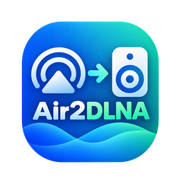

<p align="center"></p>

<h1 align="center">Air2DLNA</h1>

<p align="center">把局域网里的 <b>DLNA / UPnP 音响</b>变成 <b>AirPlay 2 音箱</b> —— 飞牛 fnOS 原生应用，不需要 Docker。</p>

AirPlay 2 是 Apple 设备独占的协议，而大量音响只支持 DLNA/UPnP。Air2DLNA 在飞牛 NAS 上内置一个**真正的 AirPlay 2 接收器**（shairport-sync + NQPTP），把 Apple 设备推来的音频实时解码成 PCM，再通过标准 UPnP AVTransport 控制 + 实时 HTTP 流交给局域网 DLNA 音响。iPhone / iPad / Mac 的 AirPlay 列表里会直接多出一个音箱，使用体验与原生 AirPlay 2 音箱一致。

**核心特点**

- **真正的 AirPlay 2 接收**：注册 `_airplay._tcp`（含 HomeKit 配对公钥）与兼容用 `_raop._tcp`，不是 AirPlay 1 兼容层
- **实时桥接、不落盘**：PCM 经内存环形缓冲由渲染器边产生边拉取，全程不写磁盘
- **自动发现 + 能力协商**：SSDP 发现局域网 DLNA 设备，先解析 `protocolInfo` 再推流，设备不支持时明确说明原因
- **状态完整同步**：播放状态、标题/艺术家/专辑/封面、进度、音量；进程崩溃自动重启，渲染器掉线标记离线且不擅自切换设备
- **原生 fpk 应用**：应用中心一键安装/升级/卸载，内置 Web UI 管理 AirPlay 名称、设备选择与日志

```text
iPhone / iPad / Mac
        │  AirPlay 2
        ▼
┌──────────────────────────────────────┐
│ 飞牛 NAS 原生应用（无 Docker）        │
│  shairport-sync + NQPTP               │
│        ↓ 解密 / ALAC·AAC 解码          │
│  bridge.py：PCM 环形缓冲 + 时间线      │
│        ↓ 实时 HTTP 流（WAV / LPCM）    │
│  UPnP AVTransport 控制                │
└──────────────┬───────────────────────┘
               │ LAN
               ▼
        DLNA / UPnP 音响
```

---

## 1. 安装

```bash
# 在飞牛 NAS 上（应用中心也可直接手动安装 .fpk）
appcenter-cli install-fpk Air2DLNA-1.0.2.fpk --volume 1
appcenter-cli start air2dlna
```

依赖：应用中心里的 **Python 3.12**（`python312`，已在 `manifest` 中声明为
`install_dep_apps`，安装时自动准备）。**不需要 Docker**，不需要联网安装 pip 包。

### 首次使用

1. 打开应用：**应用中心 / 桌面点击本应用图标**（走飞牛统一网关）；也可直接在浏览器
   访问 `http://<NAS_IP>:8788`。
2. 在「AirPlay 音箱名称」里填一个名字（默认 `Feiniu AirPlay`），保存。
   这个名字会出现在 iPhone 的 AirPlay 列表里。
3. 点「搜索设备」，在「DLNA 播放设备」里选择你的音响。
4. 在 iPhone 控制中心 → AirPlay → 选择上面那个名字，即可播放。

之后日常使用完全不需要再打开 NAS。

> 桌面入口实现：应用中心/桌面图标通过飞牛统一网关访问应用（`gatewaySocket` +
> `gatewayPrefix`，见 `app/ui/config`），服务端监听 `target/air2dlna.sock` 并剥离
> `/app/air2dlna` 前缀。注意飞牛 `ui/config` 只认 `${...}` 形式的占位符，
> `{port}` / `{display_name}` 这类写法不会被替换（会导致入口打开后是空白页）。

---

## 2. 功能

| 能力 | 说明 |
|---|---|
| 真正的 AirPlay 2 接收 | 基于 shairport-sync 5.5.1（`--with-airplay-2`）+ NQPTP 1.2.8；注册 `_airplay._tcp`（含 HomeKit 配对公钥 `pk` 与 `features` 能力位）与兼容用的 `_raop._tcp` |
| 音频格式 | 输入支持 ALAC 与 AAC（内置解码 + 静态链接的 FFmpeg AAC 解码器）；5.1/7.1 自动混音为立体声；44.1k/48k 自动重采样 |
| 实时桥接 | **不落盘**：PCM 经内存环形缓冲由 DLNA 渲染器通过 HTTP 边产生边拉取 |
| DLNA 发现 | SSDP + 设备描述解析（friendlyName / UDN / model / manufacturer / 服务端点） |
| 能力协商 | `ConnectionManager#GetProtocolInfo` 解析 `protocolInfo`，优先 `audio/wav`，回退 `audio/L16`；不支持时明确拒绝并给出原因 |
| 播放控制 | Play / Pause / Stop / Seek（重锚）/ 音量；统一内部 `PlaybackState`，不逐条直译 SOAP |
| 进度同步 | 使用 shairport-sync 的 `prgr` / `phbt` 时间戳 + 单调时钟建立 `AudioTimeline`；GENA 事件优先，轮询兜底 |
| 状态展示 | 播放状态、标题/艺术家/专辑/封面、当前位置与总时长、音量、日志 |
| 异常恢复 | 渲染器掉线标记离线（不自动切换设备）、进程崩溃自动重启、AirPlay 重连重建会话 |

---

## 3. 目录结构

```text
airplay2-dlna-bridge/
├── TECHNICAL_DESIGN.md      # 技术设计（20 项必答内容）
├── manifest                 # fnOS 包清单
├── ICON.PNG / ICON_256.PNG
├── config/{privilege,resource}
├── cmd/                     # 生命周期脚本（install/upgrade/config/uninstall/main）
├── wizard/{install,config,uninstall}
├── app/
│   ├── ui/                  # Web UI（原生 HTML/CSS/JS）
│   └── server/
│       ├── bridge.py        # 主进程入口
│       ├── config_cli.py    # 生命周期脚本用的配置工具
│       ├── nqptp-watchdog.sh
│       ├── air2dlna/    # Python 包（仅标准库）
│       └── bin/  lib/       # 自编译二进制与随包库
├── scripts/build.sh         # 可复现构建
├── tests/                   # 单元测试 + 假渲染器端到端测试
└── docs/ACCEPTANCE.md       # 真机验收清单（Test 1–12）
```

---

## 4. 从源码构建

```bash
./scripts/build.sh              # 全量构建（约 5–10 分钟）
./scripts/build.sh --skip-native  # 只重新打包
# 产物：dist/Air2DLNA-1.0.2.fpk
```

脚本会：安装构建依赖 → 下载并**解包**（不安装）Avahi 开发文件 → 构建最小化静态
FFmpeg（仅 AAC/ALAC）→ 构建 NQPTP → 构建 shairport-sync（AirPlay 2 + avahi）→
收集二进制与随包 `.so` → 用官方 `fnpack` 打包。

> ⚠️ **必须用 Avahi 后端**。shairport-sync 的 `tinysvcmdns` 后端只注册
> `_raop._tcp`，不会注册 AirPlay 2 需要的 `_airplay._tcp`
> （源码核实：`config.regtype2` 只在 `mdns_avahi.c` 中使用）。
> 用错后端会导致 Apple 设备把本机当成 AirPlay 1 设备。
> 构建脚本会校验产物包含 `Avahi` 字样，否则直接失败。

---

## 5. 测试

```bash
# 单元测试（元数据解析、环形缓冲、时间线、SOAP 构造、protocolInfo 选择、配置迁移）
python3 -m unittest discover -s tests

# 端到端集成测试：真实 SSDP + 真实 SOAP + 真实 HTTP 拉流
# 使用真实线格式的元数据/FIFO 事件驱动，验证到"渲染器收到逐字节一致的 PCM"
python3 tests/integration_test.py
```

集成测试会启动 `tests/fake_renderer.py`（一个会真的通过 HTTP 拉流的模拟
MediaRenderer），覆盖：发现 → 选择 → 能力协商 → SetAVTransportURI(DIDL-Lite) →
Play → WAV 头与 PCM 内容校验 → 音量映射 → 暂停/恢复 → Seek 重锚 → Stop。

---

## 6. 运行数据与日志

| 内容 | 路径 |
|---|---|
| 配置 | `/vol1/@appconf/air2dlna/config.json` |
| 应用日志（结构化，带轮转） | `/vol1/@appdata/air2dlna/bridge.log` |
| 生命周期日志 | `/vol1/@appdata/air2dlna/main.log` |
| 进程 stdout/stderr（启动异常兜底） | `/vol1/@appdata/air2dlna/bridge-stderr.log` |
| 接收器日志 | `/vol1/@appdata/air2dlna/shairport-sync.log` |
| 时钟守护进程日志 | `/vol1/@appdata/air2dlna/nqptp.log` |
| PCM / 元数据 FIFO | `/vol1/@appdata/air2dlna/{audio,metadata}.fifo` |

**日志不会无限增长**：所有日志都有上限 —— 单个文件超过 **5 MB** 时自动只保留
**尾部 1 MB**（原地重写，对正在写入的进程完全无感）。

- `bridge.log`：标准库 `RotatingFileHandler`（5 MB × 5 个备份）
- `main.log` / `bridge-stderr.log`：启动与停止时轮转，并由 nqptp 看护脚本每 60 秒检查
- `shairport-sync.log`：由进程监管循环每 60 秒检查
- `nqptp.log`：由看护脚本每 60 秒检查

升级**不会**删除配置；卸载时可在向导里选择保留或删除。

### 常用排查

```bash
appcenter-cli status air2dlna          # 运行状态
tail -f /vol1/@appdata/air2dlna/bridge.log
avahi-browse -rt _airplay._tcp             # 应能看到你的 AirPlay 名称与 features=...
ss -lunp | grep -E ':319|:320'             # NQPTP 的 PTP 端口
```

若 iPhone 看不到设备：确认 `_airplay._tcp` 已注册、NAS 与手机在同一 LAN、
且 7000/319/320 未被其它 AirPlay 应用（如 micast / juneix.airplay2）占用。

---

## 7. 已知限制（第一阶段）

* 只支持**一个** AirPlay 接收器 → **一个** DLNA 渲染器；不做多房间同步
  （架构已预留，见设计文档第 14 节）。
* 输出格式为 WAV/LPCM；不支持 FLAC 输出（原因见设计文档第 5 节）。
* 实时流不做字节范围寻址，Seek 通过「换代 + 新 URI」实现（听感正确、状态重锚）。
* 依赖飞牛自带的 `avahi-daemon` 与 D-Bus 来完成 mDNS 注册。
